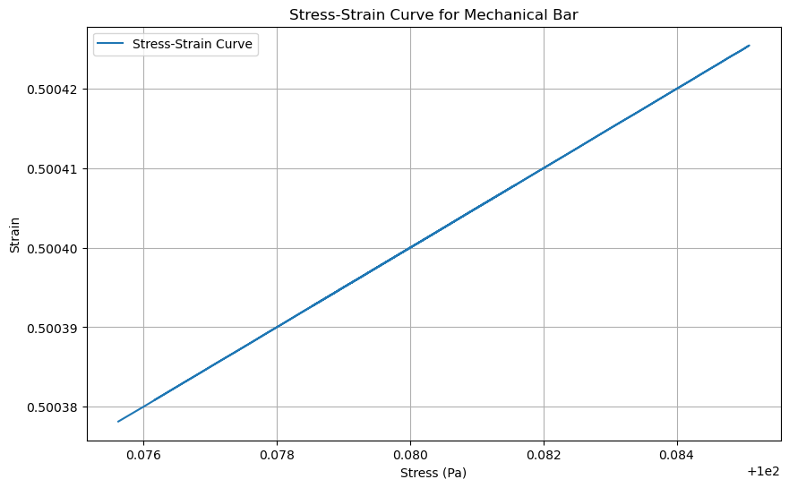

# Physics-Informed Neural Network (PINN) for Stress-Strain Analysis of a Mechanical Bar

## Overview

This project implements a Physics-Informed Neural Network (PINN) to predict the stress and strain distribution within a mechanical bar under tensile load. The PINN is trained to satisfy both the governing equations of linear elasticity and the specified boundary conditions.

## Key Features

- **Physics-Informed Learning**: Incorporates physical laws (governing equations) into the training process.
- **Automatic Differentiation**: Utilizes PyTorch's automatic differentiation to compute derivatives for the governing equations.
- **Boundary Condition Enforcement**: Enforces both fixed displacement and traction boundary conditions.
- **Mesh-Free**: The approach is mesh-free, removing the need for explicit mesh generation.

## Dependencies

- Python 3.7+
- PyTorch (>= 1.8)
- NumPy
- Matplotlib

To install the necessary dependencies, use:

```
pip install torch numpy matplotlib
```

## Implementation Details

### 1. Neural Network Architecture (StressStrainNN)

- **Input**: Spatial coordinate $$x$$ along the bar.
- **Output**: Displacement $$u(x)$$ at that coordinate.
- **Architecture**:
  - Input Layer: Linear layer with 1 input and 50 output features.
  - Hidden Layers: Two Tanh-activated linear layers, each with 50 neurons.
  - Output Layer: Linear layer with 50 inputs and 1 output feature.

### 2. Mathematical Formulation

The loss enforces:

1. **Stress-Strain Relationship**:
   $$ \sigma = E \cdot \epsilon = E \cdot \frac{du}{dx} $$

2. **Equilibrium Equation**:
   $$ \frac{d\sigma}{dx} + f(x) = 0 $$

3. **Loss Function**:
   $$ \mathcal{L}_{\text{physics}} = \frac{1}{N} \sum_{i=1}^N \left( \frac{d\sigma}{dx}(x_i) + f(x_i) \right)^2 $$

### 3. Boundary Loss (boundary_loss)

- **Purpose**: Enforces boundary conditions at the ends of the bar.
- **Boundary Conditions**:
  - Fixed Displacement: $$u(0) = 0$$ (clamped end)
  - Applied Stress (Traction): $$\sigma(L) = \frac{F}{A}$$ (free end)
- **Implementation**:
  - Computes the loss as the sum of squared differences between predicted values and boundary constraints.

### 4. Training Loop

- **Optimizer**: Adam optimizer to update the weights of the neural network.
- **Training Data**: Spatial coordinates generated randomly across the bar's length.
- **Loss Calculation**: Sum of `physics_loss` and `boundary_loss`.
- **Backpropagation**: Compute gradients and update weights.
- **Logging**: Track losses (physics, boundary, total) over training epochs.

## Usage

1. **Clone the Repository:**
   ```
   git clone [repository_url]
   cd [repository_directory]
   ```

2. **Run the Training Script:**
   ```
   python main.py
   ```

3. **Modify Parameters:**
   - Adjust the bar length, Young's modulus, applied force, cross-sectional area, learning rate, and number of epochs within `main.py`.
   - Modify the neural network architecture in the `StressStrainNN` class.

## Code Structure

```
.
├── main.py               # Main training script
├── README.md             # This file
```

## Results

During training, the total loss, physics loss, and boundary loss are printed to the console. After training, the trained model can be used to predict the stress and strain distribution within the mechanical bar.


## Limitations and Future Work

- The current implementation assumes a linear elastic material. Future work could extend the model to handle nonlinear materials.
- Only 1D bars are supported. Extending to 2D and 3D geometries would enhance the model's versatility.
- The code could be optimized for GPU usage to improve training speed.
- Implement adaptive loss weighting to balance the contributions of the physics and boundary losses.

## Contributors

Prahlad Kumar Sahu

